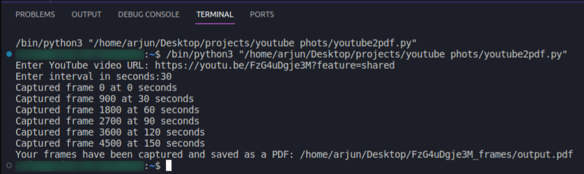

# youtubetopdf
YouTube Video to Screenshots: A Python script that captures frames from a video at chosen intervals to make a visual summary.

You can download a PDF with screenshots from a YouTube video taken at specific times to save time.

